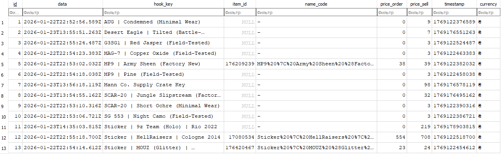
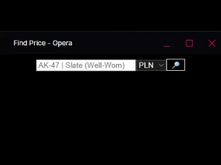

# Steam Hook Prices
Данное расширение создано для пассивного сбора цен на предметы торговой площадки Steam.
-----

-----
# v 1.1.0

Добавлена возможность работы с сервером, для общего сбора цен с разных профилей браузера или же для дальнейшем работы с данными. Данная функция не обязательна и вы можете пользоватся лишь расширением внутри браузера без внешнего сервера.

При работе с сервером `server.py` сервер должен быть запущен.
В поле ms введите время в миллисекундах по формуле: `ms = minutes × 60 × 1000`.
Таким образом вы получите интервал отправки в миллисекундах.

При использовании server.py из репозитория в поле ip введите:`http://127.0.0.1:5009/save_db_hook`.
В случае если вы используете собственный сервер — укажите свой API endpoint.

### Как это работает

Если сервер включён и отправка активирована, каждый раз при заходе на один из доменов Steam, указанных в matches манифеста, отправляется сообщение в background.js, где установлен слушатель.

После получения сообщения вызывается функция отправки, которая:

Получает из хранилища:

`ms` — интервал отправки

`last_send` — дату последней успешной отправки

`status` — состояние отправки (on / off)

Выполняет проверку: `now - last_send >= ms`.

Если интервал прошёл и сервер включён — выполняется отправка базы данных на сервер.

После получения ответа от сервера:
    если сервер вернул `status": "ok"`
    в локальном хранилище сохраняется новое значение last_send - дата последней успешной отправки
Таким образом, при каждом посещении сайта Steam выполняется проверка интервала отправки.
Если времени прошло достаточно - база данных отправляется на сервер, иначе отправка пропускается.

### База данных 

`db_hook.db` - Файл базы. 
Файл с таблицей будет создан в папке вашего сервера, после первого обращения к серверу. 

На данном скриншоте вы можете заметить, что некоторые ячейки пустые.  
Это связано с тем, что данные поступают из разных `steam-api`, и не все поля доступны в каждом типе запроса - это является нормальным поведением.

Например, при получении цены предмета из инвентаря вы не получите информацию о следующих полях:

- `price_order`  
- `name_code`  

В этом случае API возвращает только цену продажи и базовые данные.

Однако, если вы находитесь на странице предмета в торговой площадке (Market), вы сможете получить полную информацию о предмете, включая все перечисленные поля.

Не беспокойтесь: каждый раз, когда данные обновляются, они автоматически сохраняются в вашу локальную базу данных в браузере.  
То же самое происходит и с глобальной базой `db_hook.db` на сервере.

Если для предмета с ключом `hook_key`, который уже существует в базе, появляются новые данные или изменяются существующие значения, система автоматически обновит соответствующие поля в базе данных.

# v 1.2.0

Добавлена функция быстрого получения цены предмета (CS2), в случае если API Steam'a вернет json обьект с ключем `loswest_price` вы получите иннформацию о цене предмета. Если ошибка(429 и т.д) или стим иногда любит возвращать `{}` или json без ключа `lowest_price` будет текст `null`. 

Работают лишь названия на английском языке, очень важна точность и структура. 

Я подмечу , что данные не сохраняются в вашу dexie (браузерную) базу!

